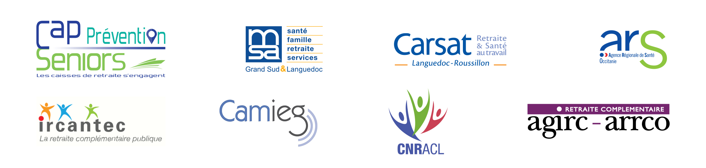

  

# SeriousGame

Ce projet est un serious-game visant à transmettre des connaissances nutritionelles de manière ludique. Le jeu est conçu pour être utilisé lors d'ateliers, afin de compléter une formation sur la nutrition. Les conseils nutritionnel sont orientés vers un public agé de 50 ans et plus et a été conçu en collaboration avec les habitants de la résidence Domitys à Nîmes.

## Comment jouer

Le jeu se joue par équipe. Deux équipes guident le personnage dans ses choix sous les directive d'un maître du jeu qui peut s'appuyer sur le jeu pour transmettre des conseils supplémentaires. Nous mettons à la disposition du maitre du jeu, un guide complet pour le guider dans sa tâche.

Le guide est disponible en suivant ce lien :

## Financeurs

  

